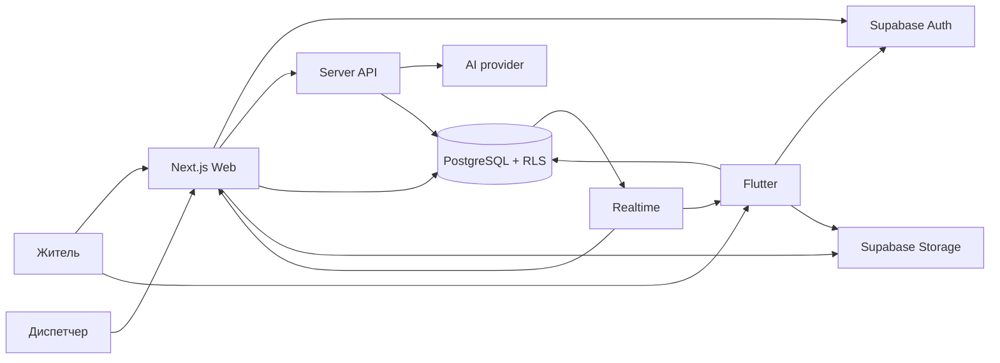
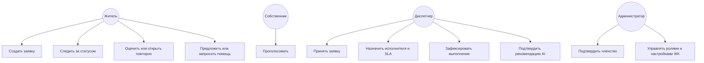
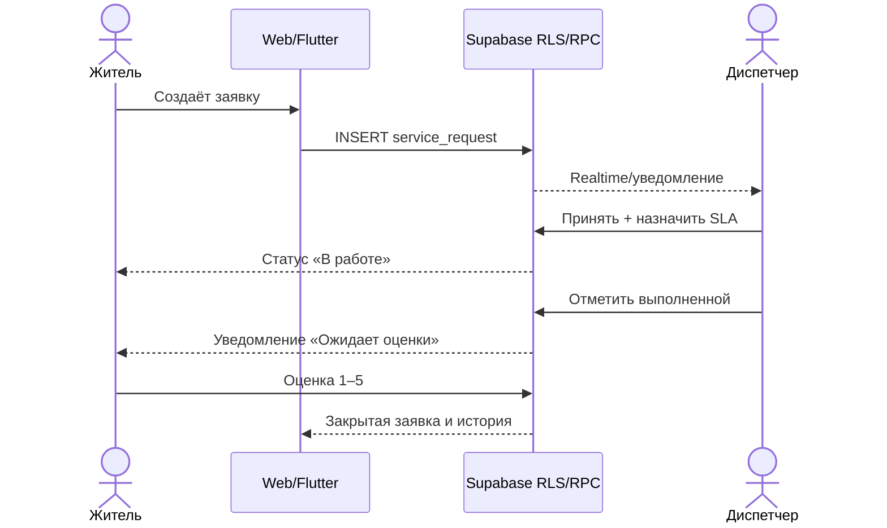
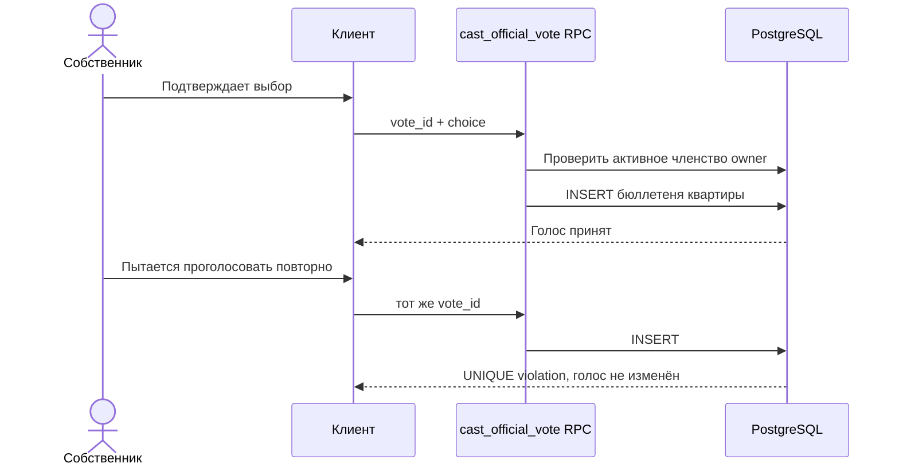

# Дипломный проект Korshi

## Паспорт проекта

**Специальность:** Software Engineering

**Тема:** «Разработка платформы для цифрового взаимодействия и взаимопомощи между жителями многоквартирных домов»

**Предзащита:** март 2027 года

## Изначальная концепция

Korshi — закрытая цифровая платформа для подтверждённых жителей многоквартирного дома, представителей ОСИ и диспетчерской службы. Она объединяет обращения по эксплуатации дома, уведомления, общение соседей, взаимопомощь и коллективные решения в одной системе с разграничением доступа по ЖК и ролям.

Главный законченный процесс диплома — жизненный цикл заявки:

1. житель описывает проблему и прикладывает материалы;
2. диспетчер принимает заявку, назначает исполнителя и срок;
3. система сохраняет историю статусов и уведомляет жителя;
4. диспетчер отмечает выполнение;
5. житель оценивает результат или повторно открывает заявку.

Дополнительные доказательные сценарии: неизменяемое голосование собственника, изоляция данных разных ЖК, защищённые документы, бронирование общего ресурса и мобильный клиент ключевых функций. AI выступает помощником диспетчера: предлагает категорию, приоритет и возможные дубли, но решение подтверждает человек.

## Проблема и цель

Домовые вопросы часто распределены между чатами, звонками и бумажными объявлениями. Из-за этого теряется история обращения, непонятен ответственный, жители не видят статус работы, а управляющая организация получает дубли и неполные сообщения.

Цель проекта — разработать проверяемую кроссплатформенную систему, которая обеспечивает единый процесс взаимодействия жителей и управляющей организации, сохраняет историю действий и защищает данные одного ЖК от пользователей другого.

## Границы диплома

### Входит в защищаемый объём

- Web-приложение как основной клиент;
- Flutter-клиент ключевых функций;
- авторизация и подтверждённое членство в ЖК;
- роли resident, owner, dispatcher, chair и admin;
- заявки, уведомления, оценка и повторное открытие;
- официальное голосование с одним неизменяемым бюллетенем от квартиры;
- документы, бронирования и базовые функции сообщества;
- offline-очередь с идемпотентностью и видимым состоянием ошибок;
- AI-классификация заявок с обязательной проверкой человеком;
- локально воспроизводимая БД, RLS и автоматические тесты.

### Ограничения текущей версии

- реальные платежи, SMS/push, ЭЦП и команды СКУД требуют внешних провайдеров;
- Flutter покрывает ключевые пользовательские процессы, а не весь Web-интерфейс;
- AI-метрики нельзя считать подтверждёнными до прогона размеченного набора на выбранной модели;
- нагрузочные показатели должны быть измерены на зафиксированной staging-конфигурации.

## Функциональные требования

| ID | Требование | Проверка |
|---|---|---|
| FR-01 | Пользователь входит в систему и получает активный контекст ЖК | E2E входа |
| FR-02 | Житель создаёт заявку и видит её после перезагрузки | E2E жизненного цикла |
| FR-03 | Диспетчер принимает и завершает заявку | E2E жизненного цикла |
| FR-04 | Житель получает уведомление и выставляет оценку | E2E жизненного цикла |
| FR-05 | Собственник голосует один раз, бюллетень нельзя изменить | E2E + pgTAP |
| FR-06 | Пользователь не читает приватные данные другого ЖК | E2E + pgTAP |
| FR-07 | Пересекающиеся бронирования отклоняются | pgTAP |
| FR-08 | Временные сетевые сбои повторяются без дублирования записи | unit + pgTAP |
| FR-09 | Ошибки прав, валидации и конфликта не повторяются как сетевые | unit |
| FR-10 | AI предлагает классификацию и сохраняет аудируемый результат | pgTAP + AI eval |

## Нефункциональные требования

| ID | Требование | Критерий |
|---|---|---|
| NFR-01 | Изоляция данных | RLS запрещает междомовой доступ даже при прямом API-запросе |
| NFR-02 | Надёжность записи | стабильный idempotency key и не более 5 повторов временной ошибки |
| NFR-03 | Аудируемость | статусы заявки, AI-задачи и значимые действия сохраняются в БД |
| NFR-04 | Доступность интерфейса | нет serious/critical нарушений axe на ключевых экранах |
| NFR-05 | Адаптивность | ключевые маршруты не имеют горизонтального переполнения на desktop/mobile |
| NFR-06 | Воспроизводимость | миграции и seed применяются к чистой локальной БД в CI |
| NFR-07 | Конфиденциальность AI | сырой запрос не пишется в `ai_jobs`, запрос провайдеру выполняется с `store: false` |

## Архитектура



Клиенты используют одну доменную модель Supabase. База данных остаётся источником истины. Политики RLS ограничивают строки по пользователю, активному ЖК и роли; операции с бизнес-инвариантами выполняются через транзакционные RPC.

## Use Case



## Sequence: обработка заявки



## Sequence: неизменяемое голосование



## Модель угроз

| Угроза | Контроль |
|---|---|
| Подмена `complex_id` в запросе | RLS сравнивает с активным членством |
| Самостоятельное повышение роли | клиентская UPDATE-политика членства удалена |
| Повтор голоса | уникальный бюллетень и запись только через RPC |
| Повтор операции после потери ответа | idempotency key и `client_mutation_receipts` |
| Бесконечная offline-очередь | лимит размера, попыток и экран проблемных действий |
| Чтение приватного файла по URL | закрытый bucket и signed URL после RLS-проверки |
| Необоснованное решение AI | обязательный human review и журнал `ai_jobs` |
| Перегрузка AI API | атомарный серверный rate limit в PostgreSQL |

## План проверки

Минимальный release gate:

```bash
pnpm type-check
pnpm lint
pnpm test:unit
pnpm db:start
pnpm exec supabase db reset
pnpm db:test
pnpm build:e2e
pnpm test:smoke
pnpm test:e2e

cd mobile
flutter analyze
flutter test
```

На 11 сентября 2026 года локально подтверждены: 33 pgTAP-проверки, 4 unit-теста offline-очереди, 45 пройденных E2E-тестов, 13 smoke-маршрутов и 10 Flutter-тестов. Один E2E пропускается только в desktop-проекте, поскольку проверяет мобильную навигацию и выполняется в mobile-проекте. Результаты нужно повторно фиксировать перед предзащитой на конкретном commit.

## Метрики для исследовательской части

До предзащиты необходимо измерить и приложить исходные данные:

- p50/p95 времени открытия ленты и создания заявки;
- долю успешных offline-повторов без дублей;
- category accuracy и macro-F1 приоритета AI на 50–100 размеченных заявках;
- время ручной классификации диспетчером с AI и без AI;
- число serious/critical accessibility-ошибок;
- покрытие требований автоматическими тестами.

## Сценарий демонстрации на 5–7 минут

1. Войти жителем и создать заявку о проблеме в подъезде.
2. В отдельной сессии войти диспетчером, принять заявку и задать срок.
3. Отметить работу выполненной.
4. Вернуться к жителю, показать уведомление и поставить оценку.
5. Перезагрузить страницу и показать сохранённую историю.
6. Показать отклонение повторного голоса собственника.
7. Показать, что пользователь другого ЖК не получает приватную заявку.
8. Кратко показать Flutter-клиент и запуск автоматических проверок.

## План до марта 2027

| Период | Результат |
|---|---|
| сентябрь–октябрь 2026 | стабилизация E2E/RLS/offline, явный demo mode, CI |
| ноябрь 2026 | завершение модульных границ requests/voting/documents и сокращение крупных repository/store |
| декабрь 2026 | размеченный AI-набор, baseline, замеры accuracy/F1 |
| январь 2027 | staging, нагрузочные измерения, сравнение с аналогами |
| февраль 2027 | пояснительная записка, диаграммы, видео-резерв демонстрации |
| март 2027 | фиксация release commit и репетиция предзащиты |
